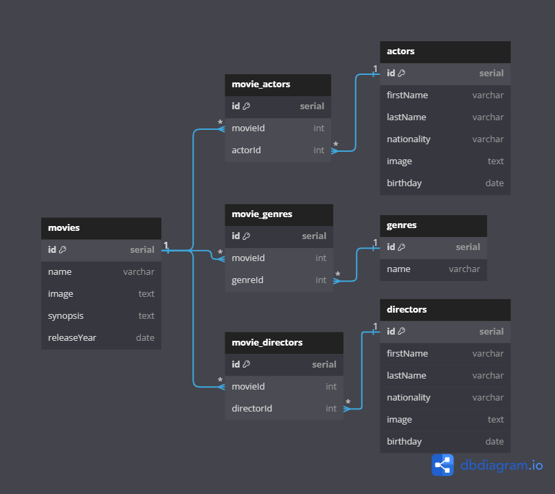

# Movie Records API.
 This API allows users to view a list of movies, add new movie records, edit existing entries, and delete movie records. It provides endpoints for retrieving movie details, creating new entries, updating movie information, and removing movies from the database. Ideal for movie enthusiasts who want to manage their movie collections.

 In the next diagram, the flow of information within our database is shown, with movies at the core of the information relationships:

## Features.

* View a list of movies.
* Create new movie records.
* Edit existing movie information.
* Delete movie records.
* Retrieve details of individual movies

## Technologies Used.

* Node.js
* Express
* Sequelize

## API Documentation
For detailed API endpoints and usage, refer to the 📃[API Documentation](https://documenter.getpostman.com/view/37160818/2sA3rwNaUp).

